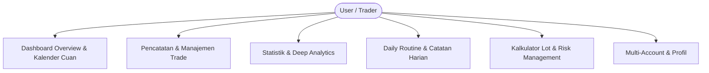
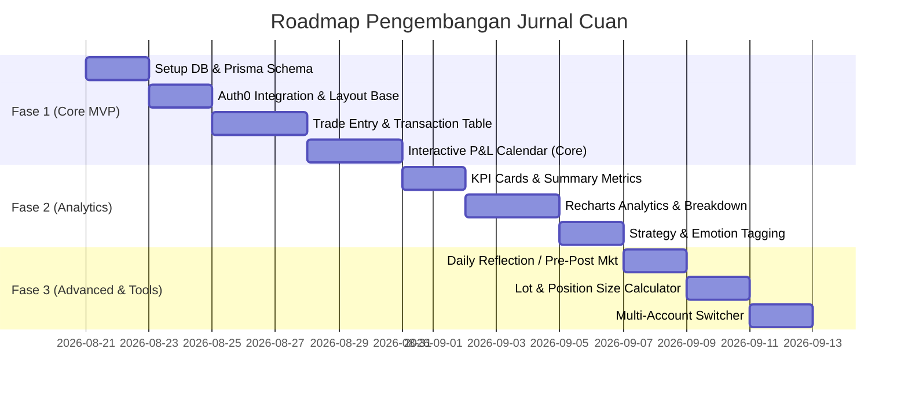

# Product Requirement Document (PRD) — Jurnal Cuan (Forex Trading Journal)

**Versi:** 1.0.0  
**Status:** Approved / Draft for Implementation  
**Target Platform:** Web Application (Responsive Desktop & Mobile)  
**Tech Stack:** Next.js 16 (App Router), React 19, Tailwind CSS v4, Radix UI / Shadcn, Prisma ORM, Auth0, Recharts, TanStack Table  

---

## 1. Executive Summary & Vision

### 1.1 Product Vision
**Jurnal Cuan** adalah aplikasi jurnal trading forex modern, analitis, dan berpusat pada disiplin trader. Aplikasi ini dirancang untuk membantu trader retail dan prop firm trader melacak setiap transaksi, menganalisis performa profit/loss (P&L) harian secara visual melalui kalender interaktif, mengevaluasi psikologi & strategi trading, serta mengelola risiko secara sistematis.

### 1.2 Target Audience (User Persona)
1. **Forex Day Trader & Scalper**: Membutuhkan pencatatan cepat, filter berdasarkan sesi trading (London, New York, Asian), dan visualisasi P&L harian.
2. **Swing Trader**: Membutuhkan pelacakan Risk-to-Reward (RR), screenshot analisis sebelum/sesudah (Before/After chart), dan catatan evaluasi setup.
3. **Prop Firm Trader (FTMO, MFF, dll.)**: Membutuhkan pemantauan batasan *Daily Drawdown* dan *Max Drawdown* agar akun tidak melanggar aturan evaluasi.

### 1.3 Arsitektur & Rincian Tech Stack

| Kategori | Teknologi / Library | Fungsi & Peran |
|---|---|---|
| **Core Framework** | **Next.js 16 (App Router)** | Framework fullstack untuk UI, API Handlers, Server Actions, & ISR Caching |
| **UI Library** | **React 19 + TypeScript** | Komponen antarmuka modern & type-safety untuk kalkulasi data finansial |
| **Database & ORM** | **PostgreSQL + Prisma ORM (v7)** | Penyimpanan data relasional, migrasi skema, dan operasi *upsert* MT5 |
| **Autentikasi** | **Auth0 (`@auth0/nextjs-auth0` v4)** | Login multi-metode (Google, Email) & proteksi middleware server-side |
| **Styling & Theme** | **Tailwind CSS v4 + `next-themes`** | Desain *Sleek Dark Trading Terminal* dengan neon profit/loss accents |
| **Komponen UI** | **Radix UI Primitives (Shadcn UI)** | Modal Dialog, Drawer, Dropdown, Tabs, dan Popover yang aksesibel |
| **Visualisasi Data** | **Recharts (v3)** | Grafik *Equity Curve*, breakdown performa per Pair, Sesi, dan Hari |
| **Tabel Transaksi** | **TanStack Table (v8)** | Tabel riwayat trade cepat dengan sorting, filter dinamis, dan pagination |
| **Manajemen Waktu** | **`date-fns` (v4)** | Konversi zona waktu server MT5 (GMT+2/3) ke zona waktu lokal user (WIB) |
| **Kalender Grid** | **`react-day-picker` (v10)** | Engine tampilan grid kalender bulanan interaktif |
| **Validasi Skema** | **Zod (v4)** | Validasi ketat untuk input formulir trade dan payload webhook MT5 |
| **Notifikasi / Toast** | **Sonner** | Toast alert interaktif untuk status transaksi & feedback pengguna |
| **Input Format Uang** | **`react-currency-input-field`** | Auto-formatting input angka desimal, nominal lot, dan mata uang |
| **Paket Ikon** | **Lucide React** | Ikon visual modern untuk trading, navigasi, dan indikator status |

---

## 2. Core Problems & Value Propositions

| Problem yang Dihadapi Trader | Solusi "Jurnal Cuan" |
|---|---|
| **Tidak Tahu Konsistensi Harian**: Sulit melihat apakah dalam sebulan lebih banyak hari profit atau loss. | **Interactive P&L Calendar**: Kalender bulanan visual dengan warna hijau/merah, nominal net P&L, dan win rate per tanggal. |
| **Overtrading & Revenge Trading**: Emosi tidak tercatat dan menyebabkan akun *blow up*. | **Psychology & Mistake Tracker**: Tagging emosi (FOMO, Greed, Revenge, Disciplined) dan evaluasi kesalahan. |
| **Tidak Tahu Setup/Pair Terbaik**: Trader sering trading di banyak pair tanpa tahu pair mana yang paling menguntungkan. | **Deep Breakdown Analytics**: Analisis performa per Pair (XAUUSD, EURUSD, GBPJPY, dll.), Sesi, dan Strategi. |
| **Manajemen Risiko Buruk**: Sering over-lot atau lupa menghitung stop loss. | **Built-in Position Size & Lot Calculator**: Kalkulator risiko otomatis berdasarkan % modal dan SL pips. |

---

## 3. Fitur Utama & Functional Requirements



### 3.1 Modul 1: Kalender Cuan Interaktif (Interactive P&L Calendar)
Fitur unggulan untuk menampilkan performa harian secara visual.

- **Kalender Grid Bulanan**:
  - Tampilan grid kalender per bulan (dengan navigasi ganti bulan/tahun).
  - Setiap tanggal menampilkan badge status:
    - **Hijau (Profit)**: Menampilkan nominal profit (misal: `+$320.50`) dan jumlah trade (misal: `3 Trades`).
    - **Merah (Loss)**: Menampilkan nominal loss (misal: `-$150.00`) dan jumlah trade.
    - **Abu-abu / Netral (Break Even / No Trade)**: Menampilkan `0.00` atau indikator istirahat.
  - Background intensitas warna menyesuaikan besaran profit/loss (heatmap effect).
- **Daily Detail Modal / Drawer (Klik Tanggal)**:
  - Ringkasan harian: Net P&L, Win Rate hari itu, Total Pips, Total Lot, Profit Factor harian.
  - Daftar transaksi yang dieksekusi pada tanggal tersebut.
  - Catatan evaluasi harian (*Daily Reflection*).
- **Weekly & Monthly Summary Bar**:
  - Menampilkan akumulasi Net P&L mingguan di sisi kanan baris kalender.
  - Total Net P&L, Win Rate bulanan, Best Day, dan Worst Day di bagian atas kalender.

---

### 3.2 Modul 2: Trade Entry & Journaling (Pencatatan Transaksi)

- **Form Tambah/Edit Trade**:
  - **Account Selector**: Pilih akun trading (jika memiliki multi-akun, misal: Personal vs Prop Firm).
  - **Pair / Instrument**: Dropdown/combobox pair forex utama (EURUSD, GBPUSD, USDJPY, XAUUSD/Gold, BTCUSD, dll.) dengan fitur custom input.
  - **Direction**: `BUY (Long)` atau `SELL (Short)`.
  - **Execution Timestamps**:
    - Waktu Open (Tanggal & Jam).
    - Waktu Close (Tanggal & Jam).
  - **Trading Session**: Otomatis terdeteksi dari jam open atau manual (Asian/Tokyo, London, New York, London-NY Overlap).
  - **Pricing & Size**:
    - Entry Price, Exit Price, Stop Loss, Take Profit.
    - Lot Size (Volume).
    - Commission & Swap fees.
  - **Hasil & Metrik Otomatis (Auto-calculated)**:
    - Net P&L ($ atau mata uang akun).
    - Net Pips.
    - Risk to Reward Ratio (Planned R:R vs Realized R:R).
    - Return on Account (%).
    - Status: `WIN`, `LOSS`, `BE (Break Even)`, atau `OPEN`.
  - **Strategi & Setup Tagging**:
    - Contoh tag: `Breakout`, `SMC / Order Block`, `SnR Retest`, `Trend Following`, `News Trading`, `Scalping`.
  - **Psikologi & Emosi (Emotional State)**:
    - Tag emosi: `Disciplined`, `FOMO`, `Revenge Trade`, `Anxious / Ragu`, `Greedy`, `Impulsive`.
  - **Mistake Tagging**:
    - Tag kesalahan: `Moved SL early`, `Late Entry`, `Chasing Market`, `Over-leverage`, `No SL`, `Exited too early`.
  - **Lampiran Chart (Screenshot)**:
    - Upload / paste URL gambar chart *Before Entry* (analisis awal) dan *After Exit* (hasil eksekusi).
  - **Catatan Analisis**: Text area markdown untuk ulasan detail mengapa trade diambil dan evaluasi hasilnya.

---

### 3.3 Modul 3: Dashboard & Performance Analytics

- **Key Performance Indicators (KPI Cards)**:
  - **Net Cumulative P&L**: Total profit bersih keseluruhan atau dalam rentang waktu filter.
  - **Win Rate (%)**: Persentase kemenangan transaksi (`(Total Win / Total Closed Trades) * 100`).
  - **Profit Factor**: Total Gross Profit dibagi Total Gross Loss.
  - **Avg Risk:Reward**: Rata-rata rasio risiko berbanding keuntungan nyata.
  - **Max Drawdown ($ & %)**: Penurunan saldo terdalam dari titik puncak equity.
  - **Streak Tracker**: Kemenangan beruntun terpanjang (*Max Win Streak*) vs Kekalahan beruntun terpanjang (*Max Loss Streak*).
- **Grafik & Visualisasi Interaktif (Recharts)**:
  - **Cumulative Growth / Equity Curve**: Grafik garis pertumbuhan saldo modal dari waktu ke waktu.
  - **P&L by Currency Pair**: Bar chart perbandingan profit/loss per pair (mengetahui pair paling menguntungkan).
  - **P&L by Session**: Diagram performa per sesi (Asian vs London vs New York).
  - **P&L by Strategy / Setup**: Analisis strategi mana yang memiliki expectancy tertinggi.
  - **P&L by Day of Week**: Mengetahui hari trading yang paling optimal (Senin s/d Jumat).
  - **Win/Loss Distribution Chart**: Histogram persebaran hasil trade.

---

### 3.4 Modul 4: Data Table & Filtering (TanStack Table)

- **Tabel Transaksi Lengkap**:
  - Kolom: Tanggal, Akun, Pair, Posisi (BUY/SELL), Lot, Entry, Exit, Pips, Net P&L, R:R, Strategi, Status, Aksi.
  - Filter Dinamis: Filter berdasarkan rentang tanggal, status (Win/Loss), Pair, Sesi, Emosi, dan Strategi.
  - Sorting: Pengurutan kolom (misal: P&L tertinggi, tanggal terbaru).
  - Pagination & Search bar.
  - Quick action: Edit, Delete, Duplicate, View Details (Modal).

---

### 3.5 Modul 5: Daily Reflection & Routine (Catatan Harian)

- **Pre-Market Plan**:
  - Checklist berita ekonomi (High impact news: NFP, CPI, FOMC, Interest Rate).
  - Rencana pair fokus hari ini.
  - Batas risiko harian (misal: Maksimal loss hari ini $100 / 2 trade).
- **Post-Market Review**:
  - Penilaian disiplin harian (Rating 1 - 5 bintang).
  - Catatan psikologi & apa yang dipelajari hari ini.

---

### 3.6 Modul 6: Risk Management & Tools

- **Forex Position Size Calculator**:
  - Input: Saldo Akun, Risiko per Trade (% atau $), Pair Forex, Stop Loss (Pips).
  - Output: Lot Size rekomendasi, Nilai Risiko ($), Nilai Pip per Lot.
- **Drawdown Alert / Guard Limit**:
  - Pengaturan batas maksimal loss harian (misal 3% per hari).
  - Indikator peringatan visual di dashboard jika batas risiko harian telah tercapai (mencegah overtrading).

---

### 3.7 Modul 7: Integrasi MetaTrader 5 & Broker (Auto-Sync & Import)

Untuk mengotomatisasi pencatatan tanpa harus input manual satu per satu, setiap akun trading dapat memilih salah satu atau kombinasi metode integrasi berikut:

1. **Metode 1: MT5 / MT4 Report Importer (File Parser - CSV / HTML / Excel)**
   - Trader meng-export riwayat transaksi langsung dari MT5 (*History Tab → Report → HTML/CSV*).
   - Trader melakukan *Drag & Drop* file report ke halaman Import akun yang bersangkutan.
   - Parser otomatis mengekstrak: Ticket ID, Pair, Type (BUY/SELL), Lots, Open Time, Close Time, Open Price, Close Price, P&L, Swap, Commission.
   - **Strategi Timpa Data (Upsert & Deduplication)**: Jika file berisi tiket yang sudah pernah diimpor sebelumnya, sistem otomatis **menimpa / memperbarui** data transaksi tersebut tanpa membuat baris duplikat. Catatan manual (notes, tag emosi, screenshot) tetap dipertahankan.

2. **Metode 2: MT5 Auto-Sync via EA (Expert Advisor / Webhook)**
   - Disediakan script EA ringan (`JurnalCuanSync.mq5`) yang dipasang di terminal MT5 pengguna.
   - Setiap akun memiliki **Dedicated Sync API Key** yang unik.
   - Setiap ada posisi tertutup (`OnTradeTransaction`), EA langsung mengirim payload JSON melalui HTTP Webhook ke endpoint `/api/sync/mt5`.
   - Data otomatis dibuat/di-upsert secara *real-time* seketika trade ditutup di MetaTrader.

3. **Strategi Sinkronisasi & Penanganan Data Ganda (Idempotent Upsert)**:
   - Identifikasi unik berbasis kombinasi `[accountId, ticketId]`.
   - Jika data yang sama dikirim berulang kali (misal: EA mengirim ulang atau user re-upload statement bulan yang sama), database melakukan operasi **UPSERT**:
     - *Jika belum ada*: Buat record trade baru.
     - *Jika sudah ada*: Update nilai eksekusi terbaru (P&L, Exit Price, Swap, Commission) agar selalu sinkron 100% dengan MT5, dengan tetap menjaga data kustom user (*notes*, *tags*, *chart screenshots*).

---

### 3.8 Modul 8: Multi-Account Management (1 User Banyak Akun)

- **Manajemen Akun Terisolasi**:
  - 1 User login (Auth0) dapat memiliki **banyak akun trading tak terbatas** (misal: *Exness Real Scalping*, *FTMO 100K Phase 1*, *FundingPips 50K*, *Demo Swing*).
  - Setiap akun memiliki konfigurasi mandiri:
    - **Nama Akun & Broker**: Identitas akun.
    - **Nomor Akun MT5/MT4**: Untuk pencocokan statement.
    - **Metode Sinkronisasi Pilihan**: `Manual Entry`, `MT5 File Import (Metode 1)`, atau `MT5 EA Webhook (Metode 2)`.
    - **Dedicated Sync API Key**: Digunakan jika memilih Metode 2.
    - **Saldo Awal & Mata Uang Dasar**: Mendukung USD, IDR, EUR, GBP.
- **Global Account Switcher (Navbar)**:
  - User dapat beralih tampilan antar-akun secara instan melalui dropdown di navbar.
  - Opsi **"Semua Akun (All Accounts / Aggregated)"**: Menampilkan kalender gabungan dan total performa kumulatif dari seluruh akun trading user.

---

### 3.9 Modul 9: Integrasi Kalender Berita Ekonomi (Forex Economic News Calendar)

- **Live Daily Economic Calendar**:
  - Menampilkan jadwal rilis berita ekonomi global harian (dari feed ForexFactory / DailyFX API).
  - Klasifikasi dampak berita berdasarkan warna:
    - 🔴 **High Impact** (CPI, Non-Farm Payroll / NFP, FOMC Interest Rate Decision, GDP, PPI).
    - 🟠 **Medium Impact** (Retail Sales, PMI, Unemployment Claims).
    - 🟡 **Low Impact / Holiday**.
- **Pre-Trade News Warning**:
  - Alert visual di dashboard jika ada berita *High Impact* dalam rentang 30–60 menit ke depan pada mata uang terkait (USD, EUR, GBP, JPY, dll.).
- **Auto/Manual News Tagging pada Trade**:
  - Opsi penandaan apakah sebuah trade dieksekusi mendekati waktu rilis berita (`isNewsTrade: true`), serta pencatatan nama peristiwanya (misal: "NFP Release").

---

### 3.10 Modul 10: Shareable "Cuan Card" Generator (Sosmed Recap Image)

- **Insta Story & Social Media Card Generator**:
  - Fitur ekspor gambar estetik siap bagikan untuk Instagram Story (9:16), Twitter/X (16:9), atau Telegram/Discord (1:1).
  - Komponen kartu didesain dengan gaya *Sleek Dark Cyber Terminal* dengan aksen glow neon hijau/merah.
  - **Data yang Dimuat pada Kartu**:
    - Tanggal / Periode (misal: "Daily Recap - 20 Aug 2026").
    - Net P&L (nominal $ dan persentase return).
    - Win Rate & Jumlah Trade hari itu.
    - Top Performing Pair (misal: `XAUUSD +$420.00`).
    - Watermark / Logo personal trader & "Jurnal Cuan".
  - Mekanisme: Dibuat langsung di sisi klien menggunakan HTML5 Canvas / `html-to-image` dengan tombol satu-klik "Download Image" atau "Copy to Clipboard".

---

### 3.11 Modul 11: Progressive Web App (PWA) & Mobile First Experience

- **Aplikasi Web Terinstal (Installable PWA)**:
  - Konfigurasi `manifest.json`, icon app, dan Service Worker agar aplikasi dapat diinstal langsung ke Home Screen smartphone (Android & iOS).
  - Tampilan *standalone app* tanpa address bar browser.
- **Mobile-Optimized Touch UI**:
  - Bottom navigation bar untuk navigasi cepat (Kalender, Trade Log, Analytics, Kalkulator).
  - Swipe gestures & responsive drawer modals saat mengecek rincian transaksi harian dari smartphone.

---

### 3.12 Modul 12: Ekspor Laporan PDF Bulanan (Monthly Performance PDF Report)

- **Laporan Evaluasi Trading Bulanan**:
  - Generator laporan PDF profesional untuk pembukuan, arsip pribadi, atau evaluasi bersama mentor/komunitas.
  - **Struktur Dokumen PDF**:
    1. **Cover & Ringkasan Eksekutif**: Total Cuan, ROI bulanan, Win Rate, Profit Factor, Max Drawdown.
    2. **Monthly Calendar Heatmap**: Snapshot visual kalender P&L bulan tersebut.
    3. **Equity Curve & Growth Chart**: Grafik pertumbuhan akun per hari.
    4. **Breakdown Analytics**: Tabel performa per Pair, Sesi, dan Strategi.
    5. **Psychology & Mistake Summary**: Evaluasi kesalahan paling sering dan tingkat disiplin harian.
    6. **Trade Log Table**: Rincian riwayat transaksi lengkap.

---

### 3.13 Modul 13: Shareable Live Account Portfolio (Public Live P&L View)

Fitur untuk membagikan performa akun trading secara *live* dan transparan kepada publik/komunitas melalui tautan URL khusus (read-only):

- **Tautan Publik Unik (Custom Public URL)**:
  - Format URL publik yang bersih dan mudah dibagikan: `/share/[username]/[account-slug]` atau tautan token unik.
  - Pengunjung dapat membuka link langsung tanpa perlu login / registrasi.
- **Tampilan Live Dashboard untuk Publik**:
  - **Live P&L Calendar**: Kalender bulanan interaktif pemilik akun (hijau/merah & win rate harian).
  - **Equity Growth Curve**: Grafik pertumbuhan saldo/keuntungan dari awal hingga saat ini.
  - **Statistik Kinerja Utama**: Win Rate (%), Total Net Gain (%), Profit Factor, Total Trades, dan Avg R:R.
  - **Recent Trades Feed**: Daftar transaksi yang sudah tertutup beserta detail pair dan R:R.
- **Kontrol Privasi Pemilik Akun (Owner Privacy Controls)**:
  - **Toggle ON/OFF Public Sharing**: Akun dapat dijadikan publik atau kembali privat kapan saja dengan satu klik.
  - **Mode Sembunyikan Nominal Dolar (Hide Dollar Amounts)**: Opsi untuk menyembunyikan nominal saldo uang asli dan hanya menampilkan persentase pertumbuhan (`%`) serta rasio `R:R`.
  - **Mode Sembunyikan Posisi Terbuka (Hide Open Positions)**: Menjaga privasi posisi yang sedang aktif (*floating*) dan hanya menampilkan trade yang sudah di-*close*.
  - **Profil Publik Trader**: Menampilkan nama/alias trader, bio singkat, dan tautan sosial media (Instagram, Twitter/X, Telegram).

---

## 4. Skema Basis Data (Database Schema - Prisma ORM)

```prisma
datasource db {
  provider = "postgresql" // atau mysql sesuai database pilihan
  url      = env("DATABASE_URL")
}

generator client {
  provider = "prisma-client-js"
}

enum TradeDirection {
  BUY
  SELL
}

enum TradeStatus {
  OPEN
  WIN
  LOSS
  BREAK_EVEN
}

enum TradingSession {
  ASIAN
  LONDON
  NEW_YORK
  OVERLAP
  OTHER
}

enum SyncMethod {
  MANUAL_ENTRY
  MT5_FILE_IMPORT
  MT5_EA_WEBHOOK
}

model User {
  id            String           @id @default(uuid())
  auth0Id       String           @unique
  email         String           @unique
  name          String?
  username      String?          @unique // Username unik untuk URL publik: /share/[username]
  bio           String?          @db.Text
  avatarUrl     String?
  currency      String           @default("USD")
  timezone      String           @default("Asia/Jakarta") // Zona waktu pengguna (e.g. Asia/Jakarta / WIB)
  createdAt     DateTime         @default(now())
  updatedAt     DateTime         @updatedAt
  accounts      TradingAccount[]
  strategies    Strategy[]
  dailyJournals DailyJournal[]
}

model TradingAccount {
  id                String      @id @default(uuid())
  userId            String
  user              User        @relation(fields: [userId], references: [id], onDelete: Cascade)
  name              String      // e.g. "FTMO 100k Challenge", "Personal Exness"
  broker            String?     // e.g. "Exness", "IC Markets", "FTMO"
  accountNumber     String?     // Nomor akun MT5/MT4
  accountType       String?     // Real, Demo, PropFirm
  syncMethod        SyncMethod  @default(MANUAL_ENTRY) // Metode 1 / Metode 2 / Manual
  syncApiKey        String?     @unique // Unique API Key per akun untuk EA Webhook MT5
  initialBalance    Decimal     @default(0.0) @db.Decimal(15, 2)
  currentBalance    Decimal     @default(0.0) @db.Decimal(15, 2)
  currency          String      @default("USD")
  
  // Pengaturan Berbagi Publik (Live Shareable)
  isPublic          Boolean     @default(false)
  publicSlug        String?     // Slug URL akun, e.g. "ftmo-100k-challenge"
  hideDollarAmounts Boolean     @default(false) // Sembunyikan nominal $, tampilkan % & R:R saja
  hideOpenTrades    Boolean     @default(true)  // Sembunyikan posisi yang masih floating/open
  
  isArchived        Boolean     @default(false)
  createdAt         DateTime    @default(now())
  updatedAt         DateTime    @updatedAt
  trades            Trade[]

  @@unique([userId, publicSlug])
}

model Trade {
  id              String         @id @default(uuid())
  accountId       String
  account         TradingAccount @relation(fields: [accountId], references: [id], onDelete: Cascade)
  ticketId        String?        // Identifier MT5 Position ID untuk mencegah duplikasi & upsert
  syncSource      String         @default("MANUAL") // MANUAL | MT5_IMPORT | MT5_WEBHOOK
  
  // Info Transaksi
  pair            String         // e.g. "XAUUSD", "EURUSD", "GBPJPY"
  direction       TradeDirection // BUY / SELL
  session         TradingSession @default(LONDON)
  
  // Waktu (Disimpan dalam format UTC standar)
  openTime        DateTime
  closeTime       DateTime?
  
  // Eksekusi & Harga
  lotSize         Decimal        @db.Decimal(10, 2)
  entryPrice      Decimal        @db.Decimal(15, 5)
  exitPrice       Decimal?       @db.Decimal(15, 5)
  stopLoss        Decimal?       @db.Decimal(15, 5)
  takeProfit      Decimal?       @db.Decimal(15, 5)
  
  // Biaya & Hasil
  commission      Decimal        @default(0.0) @db.Decimal(10, 2)
  swap            Decimal        @default(0.0) @db.Decimal(10, 2)
  netPnL          Decimal?       @db.Decimal(15, 2)
  netPips         Decimal?       @db.Decimal(10, 1)
  riskRewardRatio Decimal?       @db.Decimal(10, 2)
  status          TradeStatus    @default(OPEN)
  
  // Tagging & Psikologi (Tetap dipertahankan saat data MT5 di-upsert/timpa)
  strategyId      String?
  strategy        Strategy?      @relation(fields: [strategyId], references: [id], onDelete: SetNull)
  emotionTag      String?        // e.g. "Disciplined", "FOMO", "Revenge"
  mistakeTag      String?        // e.g. "Moved SL", "Early Exit"
  isNewsTrade     Boolean        @default(false)
  newsEventName   String?        // e.g. "US CPI Release", "NFP"
  
  // Media & Catatan
  chartBeforeUrl  String?        @db.Text
  chartAfterUrl   String?        @db.Text
  notes           String?        @db.Text
  
  createdAt       DateTime       @default(now())
  updatedAt       DateTime       @updatedAt

  // Kunci komposit unik agar jika tiket yang sama diimpor ulang, otomatis ditimpa (Upsert)
  @@unique([accountId, ticketId])
  @@index([accountId, openTime])
  @@index([pair])
}

model Strategy {
  id          String   @id @default(uuid())
  userId      String
  user        User     @relation(fields: [userId], references: [id], onDelete: Cascade)
  name        String   // e.g. "Supply & Demand Breakout", "SMC Silver Bullet"
  description String?  @db.Text
  color       String?  // Hex code untuk visualisasi badge/chart
  createdAt   DateTime @default(now())
  updatedAt   DateTime @updatedAt
  trades      Trade[]
}

model DailyJournal {
  id             String   @id @default(uuid())
  userId         String
  user           User     @relation(fields: [userId], references: [id], onDelete: Cascade)
  date           DateTime @db.Date // YYYY-MM-DD
  preMarketPlan  String?  @db.Text
  postReview     String?  @db.Text
  disciplineRate Int?     // 1 to 5
  mood           String?  // e.g. "Calm", "Frustrated", "Confident"
  createdAt      DateTime @default(now())
  updatedAt      DateTime @updatedAt

  @@unique([userId, date])
}
```

---

## 5. Kebutuhan Non-Fungsional & Solusi Teknis Edge Cases

### 5.1 Standar UI/UX, Performa & Keamanan
1. **UI/UX & Desain Estetik**:
   - Tema gelap modern (*Sleek Trading Terminal Dark Mode*) sebagai tampilan utama dengan aksen hijau neon (`#10B981` / `#22C55E`) untuk profit dan merah tegas (`#EF4444` / `#F43F5E`) untuk loss.
   - Tipografi yang modern dan nyaman dibaca untuk angka desimal (*Geist*, *Inter*, atau *JetBrains Mono* untuk nominal pips/harga).
   - Transisi halus, skeleton loading state, dan sonner toast notification.
2. **Performa & Validasi**:
   - Initial page load time < 1.2 detik.
   - Validasi skema input formulir menggunakan Zod untuk mencegah invalid values (lot negatif, harga tidak rasional).
   - Isolasi data penuh per user (`userId` check di semua Server Action & API Handler).
3. **Keamanan & Autentikasi**:
   - Autentikasi aman melalui Auth0 SDK v4 dengan proteksi middleware pada seluruh route privat.

---

### 5.2 Solusi Teknis Domain Spesifik Forex (Technical Mitigations)

#### 1. Solusi Normalisasi Timezone (MT5 Server vs Waktu Lokal Trader)
- **Problem**: Server MT5 broker umumnya beroperasi pada zona waktu **GMT+2 / GMT+3 (EET/EST)**, sedangkan pengguna bertransaksi pada waktu lokal (misal: **GMT+7 / WIB**). Jika tidak dinormalisasi, transaksi dini hari akan salah masuk ke tanggal sebelumnya pada Kalender Cuan.
- **Solusi Implementasi**:
  - Semua timestamp (`openTime`, `closeTime`) yang diterima dari parser MT5 dikonversi ke **ISO 8601 UTC** sebelum disimpan di database.
  - Setiap user memiliki preferensi `timezone` (default: `Asia/Jakarta`).
  - Rendering kalender, filter tanggal harian, dan grafik statistik menggunakan library `date-fns-tz` untuk mengonversi UTC database ke zona waktu lokal pengguna secara akurat.

#### 2. Solusi Struktur Tiket MT5 & Penanganan Partial Close
- **Problem**: Pada MT5, sebuah posisi yang mengalami *Partial Close* (misal: tutup 0.5 lot di TP1, dan 0.5 lot sisanya di TP2) menghasilkan **1 Position ID yang sama** namun memiliki **beberapa Deal ID penutupan**.
- **Solusi Implementasi**:
  - Kolom `ticketId` pada model `Trade` mengikat **MT5 Position ID** sebagai identitas unik utama transaksi.
  - Pada proses parser/sync MT5:
    - Jika terdeteksi Deal baru dari Position ID yang sama: Sistem menghitung **rata-rata tertimbang harga penutupan (*Weighted Average Exit Price*)**, mengakumulasi total `lotSize` yang tertutup, menjumlahkan total `netPnL`, `commission`, dan `swap`.
    - Data transaksi yang sudah ada diperbarui (*upsert*) secara utuh sehingga tetap tercatat sebagai 1 trade konsisten dengan ringkasan profit bersih total.

#### 3. Solusi Presisi & Kalkulasi Standar Pip Tiap Kelompok Instrumen
- **Problem**: Nilai 1 Pip berbeda antar instrumen: 4 desimal pada Forex Major, 2 desimal pada JPY Pairs, 1 desimal/poin pada Gold (XAUUSD), dan tick point pada Crypto/Indeks.
- **Solusi Implementasi**:
  - Disediakan engine helper kalkulasi pip modular:
    ```typescript
    export function calculatePips(pair: string, entryPrice: number, exitPrice: number, direction: 'BUY' | 'SELL'): number {
      const p = pair.toUpperCase();
      let pipMultiplier = 10000; // Standar Major/Minor (EURUSD, GBPUSD)
      
      if (p.includes('JPY')) {
        pipMultiplier = 100;     // JPY Pairs (USDJPY, GBPJPY)
      } else if (p.includes('XAU') || p.includes('GOLD')) {
        pipMultiplier = 10;      // Gold: 1 pip = $0.10 price move
      } else if (p.includes('BTC') || p.includes('US30') || p.includes('NAS100')) {
        pipMultiplier = 1;       // Point value untuk Crypto & Index
      }
      
      const diff = direction === 'BUY' ? (exitPrice - entryPrice) : (entryPrice - exitPrice);
      return Number((diff * pipMultiplier).toFixed(1));
    }
    ```

---

### 5.3 Solusi Skalabilitas & Caching Public Live Shareable Link
- **Problem**: Akses publik tanpa batas pada route `/share/[username]/[account-slug]` berpotensi membebani query database jika link viral di media sosial/komunitas trading.
- **Solusi Implementasi**:
  - **Next.js Data Caching / ISR (Incremental Static Regeneration)**: Halaman shareable menggunakan `revalidate: 60` (data di-*cache* selama 60 detik di level Edge Server). Query database hanya dieksekusi maksimal 1 kali per menit per akun publik.
  - **In-Memory Rate Limiting**: Membatasi maksimal 60 request per IP per menit pada endpoint publik untuk mencegah *scraping* atau serangan DoS.
  - **Database Read-Only Projection**: Query publik hanya mengambil field yang diizinkan (mengecualikan `syncApiKey`, data user privat, dan menyamarkan nominal `$` jika `hideDollarAmounts = true`).

---

## 6. Tahapan Pengembangan (Development Roadmap)



- **Fase 1: Core MVP (Pencatatan & Kalender Cuan)**
  - Setup skema database Prisma (PostgreSQL / MySQL) & koneksi database.
  - Implementasi autentikasi Auth0 & Layout Shell (Sidebar, Header, Account Selector).
  - Halaman input trade baru (form lengkap dengan auto-calculate P&L, Pips, RR).
  - Halaman **Kalender Cuan** bulanan dengan visualisasi Net P&L per tanggal & daily modal.
  - Tabel transaksi lengkap dengan filter dan pagination (TanStack Table).
  - Importer file laporan MT5 (Metode 1) dengan auto-upsert.

- **Fase 2: Analytics, Sync Real-time & Ekosistem Trading**
  - KPI Dashboard (Win Rate, Profit Factor, Total Cuan, Net RR, Max Drawdown).
  - Grafik pertumbuhan modal (*Equity Curve Chart*).
  - Breakdown Chart (Performa berdasarkan Pair, Sesi Trading, dan Strategi).
  - Script EA Webhook MT5 (Metode 2) & endpoint API sync.
  - Live Forex Economic News Calendar & Pre-Trade Warning.

- **Fase 3: Refleksi, Ekspor & Mobile Experience**
  - Modul *Daily Journal* (Pre-market plan & Post-market review per tanggal).
  - *Position Size & Risk Calculator* interaktif.
  - Shareable "Cuan Card" Generator (Instagram Story & X image export).
  - Shareable Live Account Portfolio & Public Profile (`/share/[username]/[account-slug]`).
  - Export Laporan PDF Bulanan (Performance Report).
  - Konfigurasi PWA (Progressive Web App) untuk smartphone.

---

## 7. User Story & Kriteria Penerimaan (Acceptance Criteria)

### User Story 1: Visualisasi Kalender P&L
- **Sebagai** seorang Forex Trader,
- **Saya ingin** melihat kalender bulanan yang menampilkan warna hijau/merah beserta nominal P&L pada setiap tanggal yang saya trading,
- **Agar** saya dapat mengevaluasi konsistensi dan rasio hari profit vs loss saya dalam sebulan secara sekilas.
- **Kriteria Penerimaan**:
  - Tanggal dengan total net P&L > 0 bertanda hijau dengan nominal profit.
  - Tanggal dengan total net P&L < 0 bertanda merah dengan nominal loss.
  - Menampilkan jumlah trade pada tanggal tersebut.
  - Klik pada tanggal membuka modal/drawer yang menampilkan rincian trade hari tersebut.
  - Terdapat akumulasi total P&L mingguan dan bulanan.

### User Story 2: Pencatatan Transaksi Cepat
- **Sebagai** seorang Forex Trader,
- **Saya ingin** mencatat posisi buy/sell, pair forex, lot, entry/exit price, dan stop loss,
- **Agar** aplikasi secara otomatis menghitung profit/loss, pips, dan rasio risk-to-reward tanpa perlu menghitung manual.
- **Kriteria Penerimaan**:
  - Sistem otomatis menghitung Net P&L dan Net Pips setelah entry & exit price dimasukkan.
  - Menghitung Risk-to-Reward Ratio (R:R).
  - Mendukung tagging sesi (London, NY, Asian) dan emosi saat eksekusi.

### User Story 3: Manajemen Banyak Akun & Pemilihan Metode Sinkronisasi
- **Sebagai** seorang Trader dengan banyak akun (Real, Prop Firm, Demo),
- **Saya ingin** membuat beberapa akun trading dalam 1 akun login dan memilih metode sinkronisasi (Upload File vs Real-time Webhook EA) secara terpisah untuk setiap akun,
- **Agar** data antar akun tetap terisolasi rapi dan saya bisa melihat performa per-akun maupun gabungan (*all accounts*).
- **Kriteria Penerimaan**:
  - User dapat membuat akun baru dan menentukan metode sync (`Manual`, `MT5 File Import`, atau `MT5 EA Webhook`).
  - Setiap akun yang menggunakan Webhook EA mendapatkan `syncApiKey` yang unik.
  - Terdapat dropdown switcher di navbar untuk berpindah antar akun atau melihat ringkasan agregat seluruh akun.

### User Story 4: Sinkronisasi Tanpa Konflik (Auto-Overwrite / Upsert)
- **Sebagai** seorang Trader yang sering mengimpor statement berkala atau menggunakan Webhook,
- **Saya ingin** sistem otomatis menimpa/memperbarui data transaksi yang memiliki Ticket ID sama tanpa memunculkan duplikat atau error,
- **Agar** seluruh data saldo, P&L, dan harga selalu sinkron 100% dengan MT5 tanpa kehilangan catatan/tag psikologi yang sudah saya buat.
- **Kriteria Penerimaan**:
  - Transaksi diidentifikasi secara unik berdasarkan `accountId` + `ticketId`.
  - Jika tiket yang sama diimpor ulang, sistem melakukan `upsert` (mengupdate nilai P&L, harga close, fee, komisi).
  - Data custom pengguna seperti `notes`, `emotionTag`, `mistakeTag`, dan URL screenshot tidak terhapus saat operasi update data MT5 terjadi.

### User Story 5: Kalender Berita Ekonomi & Peringatan High Impact
- **Sebagai** seorang Forex Trader,
- **Saya ingin** melihat jadwal rilis berita ekonomi berbobot tinggi (High Impact News seperti CPI/NFP) langsung di dashboard,
- **Agar** saya terhindar dari slippage dan volatilitas liar tanpa persiapan.
- **Kriteria Penerimaan**:
  - Widget kalender menampilkan event berita hari ini dengan badge tingkat dampak (High, Medium, Low).
  - Muncul notifikasi / alert jika ada berita berdampak tinggi dalam waktu < 60 menit.

### User Story 6: Shareable "Cuan Card" untuk Media Sosial
- **Sebagai** seorang Trader,
- **Saya ingin** membuat kartu gambar recap harian dengan desain dark-neon yang estetik dalam satu kali klik,
- **Agar** saya dapat membagikan hasil cuan harian ke Instagram Story, X, atau grup trading.
- **Kriteria Penerimaan**:
  - Tersedia opsi download gambar (PNG) dengan aspek rasio 9:16 (Story) dan 16:9 / 1:1.
  - Gambar memuat nominal P&L, Win Rate, tanggal, dan pair terbaik hari itu.

### User Story 7: Akses Cepat via Smartphone (PWA)
- **Sebagai** seorang Trader yang aktif bepergian,
- **Saya ingin** menginstal aplikasi Jurnal Cuan langsung ke layar utama smartphone,
- **Agar** saya dapat memeriksa kalender dan jurnal secara instan seperti aplikasi native.
- **Kriteria Penerimaan**:
  - Aplikasi memenuhi standar PWA dan dapat diinstall di iOS & Android.
  - Memiliki bottom navigation dan drawer dialog yang nyaman dioperasikan dengan sentuhan.

### User Story 8: Ekspor Laporan Bulanan (PDF Performance Report)
- **Sebagai** seorang Trader yang disiplin,
- **Saya ingin** mengunduh laporan PDF rangkuman performa bulanan,
- **Agar** saya memiliki arsip dokumen evaluasi performa dan catatan psikologi secara rapi.
- **Kriteria Penerimaan**:
  - Menghasilkan dokumen PDF berisi cover KPI, snapshot kalender, grafik pertumbuhan, dan analisis kesalahan.

### User Story 9: Berbagi Live Portfolio & P&L Publik (Public Shareable Link)
- **Sebagai** seorang Trader yang ingin membangun reputasi atau berbagi dengan investor/komunitas,
- **Saya ingin** membuat tautan publik untuk akun trading saya dengan kontrol privasi (sembunyikan nominal dolar atau open trade),
- **Agar** orang lain dapat melihat rekam jejak performa dan kalender cuan saya secara transparan tanpa perlu login.
- **Kriteria Penerimaan**:
  - Pemilik akun dapat mengaktifkan/menonaktifkan tombol *Public Sharing*.
  - Link publik `/share/[username]/[account-slug]` dapat diakses siapa saja dalam mode *read-only*.
  - Terdapat filter privasi: opsi menyembunyikan nominal saldo ($) dan menyembunyikan posisi yang masih floating/open.
  - Tampilan publik menyajikan kalender P&L, grafik equity curve, win rate, dan trade history yang sudah tertutup.
